# Mini-Project for Fundamentals of Machine Learning Course

This repository contains the code and data for a mini-project on facial expression recognition using machine learning algorithms.

## 📑 Project Policy
- Team: group should consist of 3-4 students.

    |No.| Student Name    | Student ID |
    | --------| -------- | ------- |
    |1|Huỳnh Lê Minh Thư|21280110|
    |2|Phạm Ngọc Phương Uyên|21280119|
    |3|Nguyễn Thị Lan Diệp|21280123|

- The submission deadline is strict: **11:59 PM** on **June 22nd, 2024**. Commits pushed after this deadline will not be considered.

## 📦 Project Structure

The repository is organized into the following directories:

- **/data**: This directory contains the facial expression dataset. You'll need to download the dataset and place it here before running the notebooks. (Download link provided below)
- **/notebooks**: This directory contains the Jupyter notebook ```EDA.ipynb```. This notebook guides you through exploratory data analysis (EDA) and classification tasks.

## ⚙️ Usage

This project is designed to be completed in the following steps:

1. **Fork the Project**: Click on the ```Fork``` button on the top right corner of this repository, this will create a copy of the repository in your own GitHub account. Complete the table at the top by entering your team member names.

2. **Download the Dataset**: Download the facial expression dataset from the following [link](https://mega.nz/file/foM2wDaa#GPGyspdUB2WV-fATL-ZvYj3i4FqgbVKyct413gxg3rE) and place it in the **/data** directory:

3. **Complete the Tasks**: Open the ```notebooks/EDA.ipynb``` notebook in your Jupyter Notebook environment. The notebook is designed to guide you through various tasks, including:
    
    1. Prerequisite
    2. Principle Component Analysis
    3. Image Classification
    4. Evaluating Classification Performance 

    Make sure to run all the code cells in the ```EDA.ipynb``` notebook and ensure they produce output before committing and pushing your changes.

5. **Commit and Push Your Changes**: Once you've completed the tasks outlined in the notebook, commit your changes to your local repository and push them to your forked repository on GitHub.


## 👻 GETTING STARTED
### 1. Prerequisite  

#### Load dataset  
The data consists of grayscale images of faces, each measuring 48x48 pixels. The faces have been automatically aligned to be roughly centered and occupy a similar area within each image. The task is to categorize each face based on the emotion expressed, assigning it to one of seven categories (0=Angry, 1=Disgust, 2=Fear, 3=Happy, 4=Sad, 5=Surprise, 6=Neutral). The dataset contains a total of 35,887 examples.  
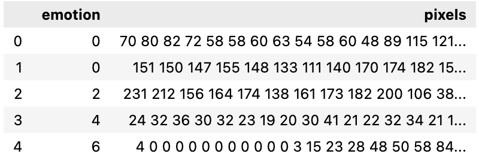  
The ```emotion``` column contains a numeric code ranging from 0 to 6, inclusive, for the emotion expressed by the image. The ```pixels``` column contains a string surrounded in quotes for each image.  

#### Checking missing and duplicated values  
The given data has no missing values ​​but has 1793 duplicate values. After removing duplicate values, the dataset is left with 34094 columns  

#### On the `emotion` column
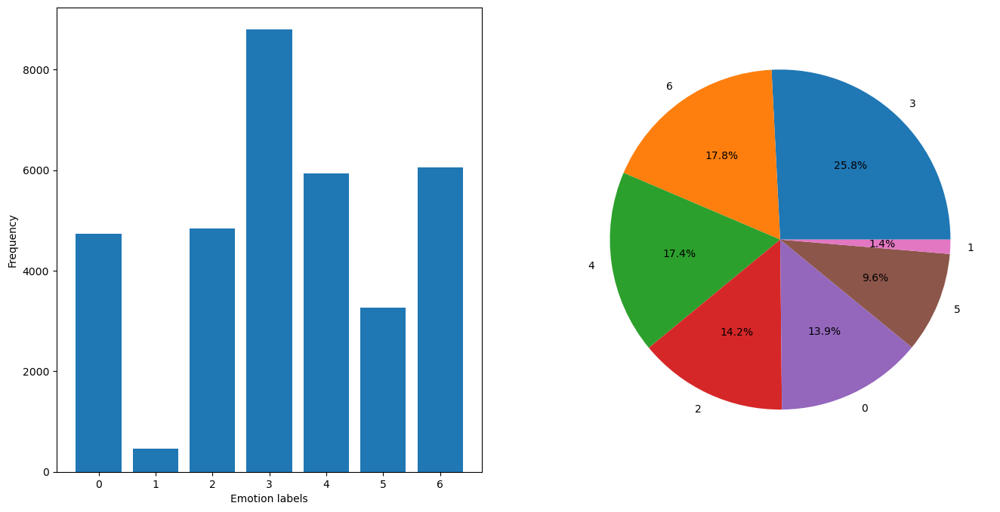  
There is an imbalance between the labels in the given dataset:  
- The number of label 3 (Happy) is too much, almost twice as many as other labels  
- Meanwhile, the number of label 1 (Disgust) is too small, accounting for about 1.4% of the data set.  

This can lead to:  
- Classification algorithms that learn from imbalanced data tend to be biased towards the majority group (in this case label 3).  
- Conventional model performance metrics, such as accuracy, can be distorted by label imbalance...  

#### Convert dataset  
Convert the data on the `pixels` column to a numpy array with:  
- images (3-dimensional array): Stores images as 2D arrays with a shape of (len(df), 48, 48).   
- image_raws: (2-dimensional array): Stores raw pixel data as 1D arrays with a shape of (len(df), 2304).
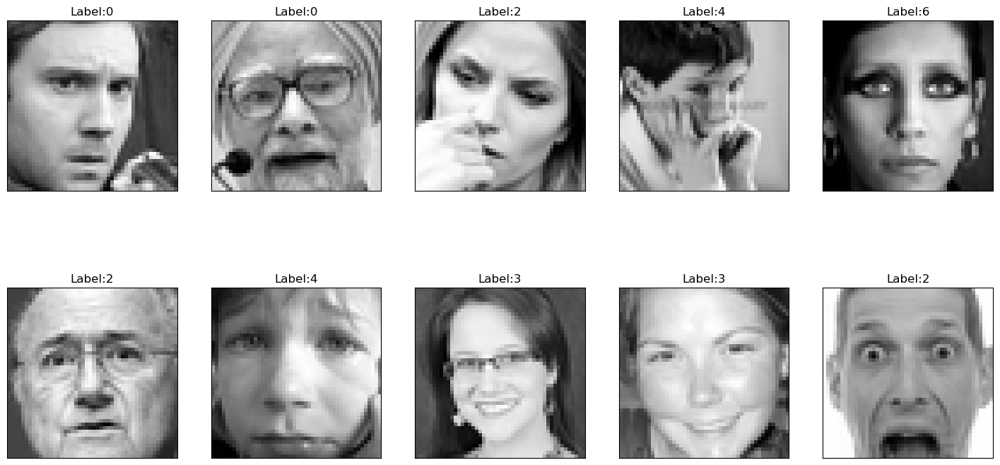   

### 2. Principle Component Analysis
Unsupervised learning can be further categorized into two main tasks: data transformation and clustering. In this study, we will focus on data transformation using unsupervised learning techniques. These techniques aim to modify the data to make it easier for computers and humans to analyze and understand.  

One of the most common applications of unsupervised data transformation is dimensionality reduction. This process reduces the number of features (dimensions) in the data. When the data has a high number of features, it can be computationally expensive and difficult to analyze. Dimensionality reduction techniques help to overcome these challenges.  

Principal Component Analysis (PCA) is a popular technique for dimensionality reduction. It transforms the data into a new set of features called principal components (PCs). These PCs are ordered by their importance, capturing the most significant variations in the data. By selecting a subset of the most informative PCs, we can achieve a significant reduction in data size while preserving the essential information for analysis.  

#### Question 1: Can you visualize the data projected onto two principal components?  
Perform PCA on the 2-dimensional matrix image_raws with 35887 rows corresponding to 35887 data images, 2304 columns corresponding to 48x48 pixel values  
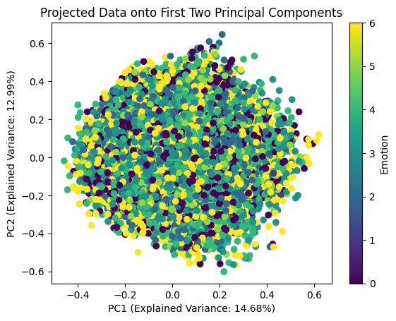   
After reducing the dimensionality of the data set using PCA with n_components = 2, we retain about 27.66% of the information (about variance) from the original data set. This could be considered low, suggesting that we need a larger number of principal components to capture more variance or that the data set is highly dimensional.  

#### Question 2: How to determine the optimal number of principal components using ```pca.explained_variance_```? Explain your selection process.  
Determining the optimal number of principal components (PCs) in Principal Component Analysis (PCA) is an important step for effective data dimensionality reduction. Choosing the appropriate number of PCs helps balance between retaining the most important information from the original data and minimizing noise and redundancy.  

A common method for determining the optimal number of PCs is to use a combination of visual and quantitative analysis based on the explained_variance_ variable of PCA. Here are the steps:  
- Step 1: Fit PCA model
```python
pca = PCA()
pca.fit(norm_images)
```

- Step 2: Explained variance ratio
```python
explained_variance_ratio = pca.explained_variance_ratio_
cumulative_explained_variance = pca.explained_variance_ratio_.cumsum()
```

- Step 3: Create a scree plot to visualize the explained variance  
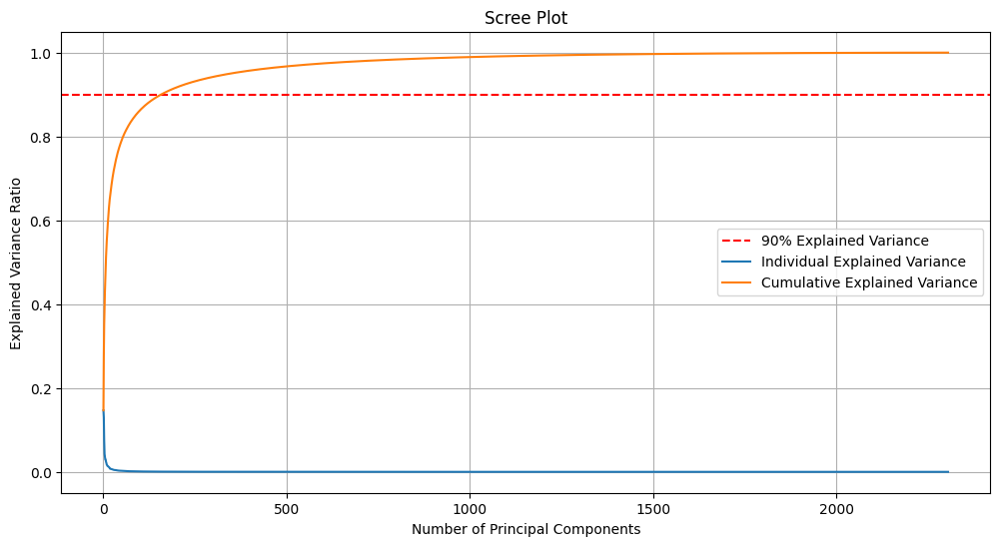
- Step 4: Determine the "Elbow" Point  
Based on the Scree Plot chart, the elbow point can be located at about 150-175 PCs, corresponding to 90% information about the variance of the original data. Therefore, choosing 158 PCs may be the optimal number of main components for this case.  
- Step 5: Threshold Method  
```python
# Optimal number of components based on explained variance threshold (e.g., 90%)
optimal_components = next(i for i, total_var in enumerate(cumulative_explained_variance) if total_var >= 0.9) + 1
```
```
Optimal number of components: 158
```
Another way to find the number of principal components is to use the threshold method. Setting the cumulative variance threshold at 90%, we find the optimal number of principal components to be 158

**Selection Process Explained**  
Scree Plot and "Elbow" Method: The scree plot shows the explained variance of each principal component. The "elbow" point, where the explained variance curve starts to flatten, indicates diminishing returns for adding more components. This point is chosen as the optimal number of components because it captures most of the variance while avoiding unnecessary complexity.  
Cumulative Variance Threshold: This method sets a threshold for the cumulative explained variance (e.g., 80% or 90%). The optimal number of components is the smallest number that meets or exceeds this threshold, ensuring that a sufficient amount of variance is captured.   
By using both the scree plot and the cumulative variance threshold, can make a well-informed decision on the optimal number of principal components for your analysis.  


### 3. Image Classification
The classification task will compare the performance using both:

- Original data: The data before applying PCA.
- Transformed data: The data projected onto the optimal number of principal components identified earlier. Utilize the **optimal number of principal components** identified in the previous question.

**Import these prerequisites before proceeding**  
```python
from sklearn.preprocessing import StandardScaler
from sklearn.model_selection import train_test_split, GridSearchCV
from sklearn.neighbors import KNeighborsClassifier
from sklearn.decomposition import PCA
from sklearn.ensemble import RandomForestClassifier
from sklearn.pipeline import Pipeline
from sklearn.metrics import accuracy_score, classification_report
```

**PCA with 158 principal components**   
```python
pca = PCA(n_components=158)
images_pca = pca.fit_transform(image_raws)
```

**Split data into train/val/test subsets**  
75-15-10 ratio for training-validation-test sets with random_state=101.  
```python
def split_data(X, y):
    train_ratio = 0.75
    validation_ratio = 0.15
    test_ratio = 0.10

    # train is now 75% of the entire data set
    x_train, x_test, y_train, y_test = train_test_split(X, y, train_size=train_ratio, random_state=101)

    # test is now 10% of the initial data set
    # validation is now 15% of the initial data set
    x_val, x_test, y_val, y_test = train_test_split(x_test, y_test, test_size=test_ratio/(test_ratio + validation_ratio), random_state=101) 
    return (x_train, x_test, x_val, y_train, y_test, y_val)
```

- On the original dataset  
```python
x_train_norm, x_test_norm, x_val_norm, y_train_norm, y_test_norm, y_val_norm = split_data(image_raws, labels)
```
Distribution Emotion Label  
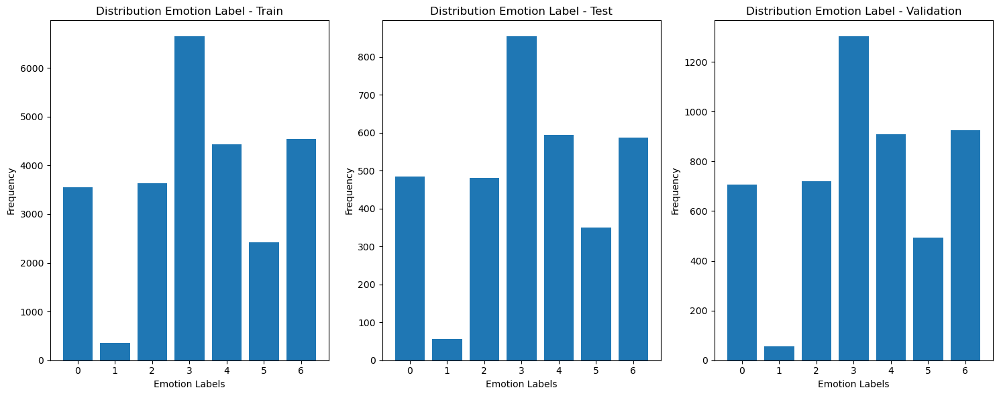   

- On the transformed dataset
```python
x_train_pca, x_test_pca, x_val_pca, y_train_pca, y_test_pca, y_val_pca = split_data(images_pca, labels)
```
Distribution Emotion Label  
   


#### Model 1. RandomForestClassifier()  
**On Original dataset**  
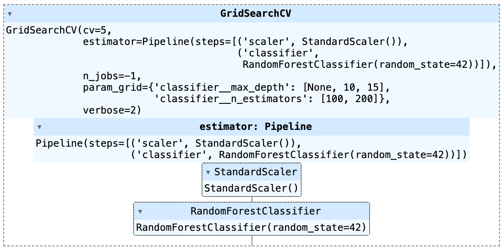  
Best parameters found: {'classifier__max_depth': None, 'classifier__n_estimators': 200}  
Best cross-validation score: 0.42061008994915916   
```
Validation Accuracy: 0.4192412983965585
Validation Classification Report:
              precision    recall  f1-score   support

           0       0.41      0.12      0.19       706
           1       1.00      0.04      0.07        56
           2       0.39      0.21      0.28       721
           3       0.42      0.79      0.55      1302
           4       0.35      0.34      0.34       910
           5       0.59      0.43      0.49       494
           6       0.42      0.38      0.40       925

    accuracy                           0.42      5114
   macro avg       0.51      0.33      0.33      5114
weighted avg       0.43      0.42      0.39      5114
```
```
Test Accuracy: 0.41642228739002934
Test Classification Report:
              precision    recall  f1-score   support

           0       0.43      0.12      0.19       485
           1       0.50      0.02      0.03        57
           2       0.32      0.18      0.23       482
           3       0.43      0.80      0.56       854
           4       0.35      0.37      0.36       594
           5       0.65      0.44      0.53       351
           6       0.38      0.36      0.37       587

    accuracy                           0.42      3410
   macro avg       0.44      0.33      0.33      3410
weighted avg       0.42      0.42      0.38      3410
```

- **On transformed dataset**  
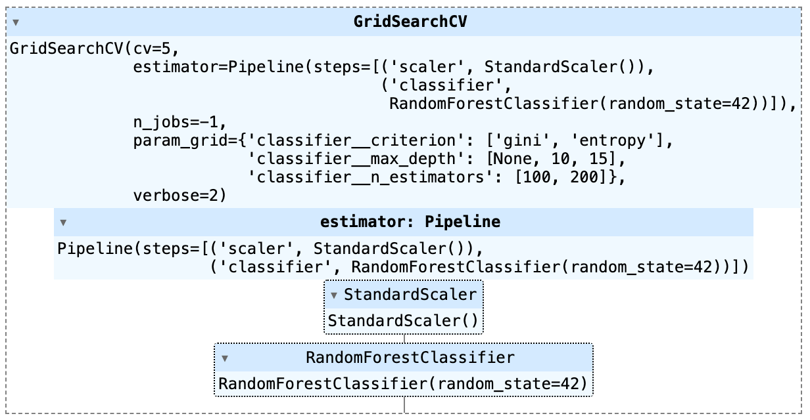  
Best parameters found: {'classifier__criterion': 'gini', 'classifier__max_depth': None, 'classifier__n_estimators': 200}  
Best cross-validation score: 0.3674618693781776
```
Validation Accuracy: 0.3597966366836136
Validation Classification Report:
              precision    recall  f1-score   support

           0       0.45      0.08      0.14       706
           1       1.00      0.02      0.04        56
           2       0.42      0.16      0.23       721
           3       0.34      0.84      0.48      1302
           4       0.33      0.23      0.27       910
           5       0.66      0.26      0.38       494
           6       0.38      0.25      0.30       925

    accuracy                           0.36      5114
   macro avg       0.51      0.26      0.26      5114
weighted avg       0.41      0.36      0.31      5114
```
```
Test Accuracy: 0.35953079178885633
Test Classification Report:
              precision    recall  f1-score   support

           0       0.42      0.07      0.13       485
           1       0.50      0.02      0.03        57
           2       0.41      0.14      0.21       482
           3       0.34      0.86      0.49       854
           4       0.34      0.24      0.28       594
           5       0.73      0.27      0.40       351
           6       0.34      0.25      0.29       587

    accuracy                           0.36      3410
   macro avg       0.44      0.27      0.26      3410
weighted avg       0.40      0.36      0.31      3410
```


#### Model 2: KNN  
**On Original dataset**  
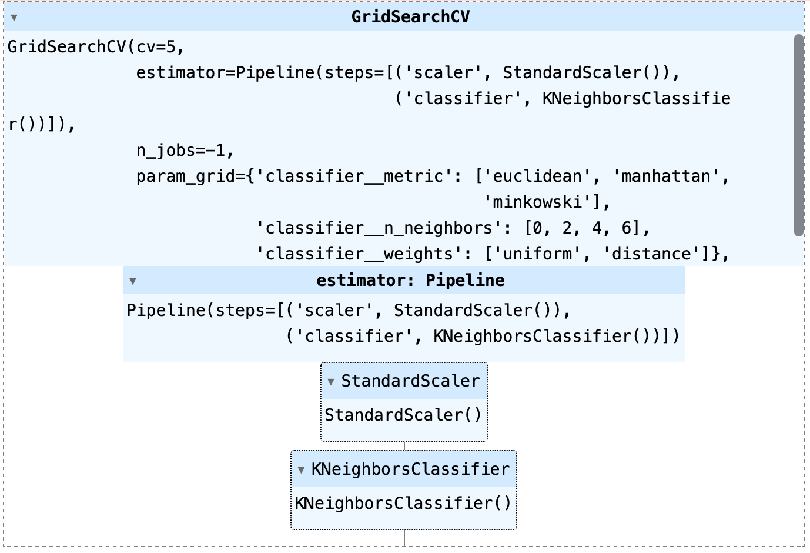  
Best parameters found: {'classifier__metric': 'euclidean', 'classifier__n_neighbors': 4, 'classifier__weights': 'uniform'}  
Best cross-validation score: 0.2598357450136879
```
Validation Accuracy: 0.2545952287837309
Validation Classification Report:
              precision    recall  f1-score   support

           0       0.00      0.00      0.00       706
           1       0.00      0.00      0.00        56
           2       0.00      0.00      0.00       721
           3       0.25      1.00      0.41      1302
           4       0.00      0.00      0.00       910
           5       0.00      0.00      0.00       494
           6       0.00      0.00      0.00       925

    accuracy                           0.25      5114
   macro avg       0.04      0.14      0.06      5114
weighted avg       0.06      0.25      0.10      5114
```
```
Test Accuracy: 0.2504398826979472
Test Classification Report:
              precision    recall  f1-score   support

           0       0.00      0.00      0.00       485
           1       0.00      0.00      0.00        57
           2       0.00      0.00      0.00       482
           3       0.25      1.00      0.40       854
           4       0.00      0.00      0.00       594
           5       0.00      0.00      0.00       351
           6       0.00      0.00      0.00       587

    accuracy                           0.25      3410
   macro avg       0.04      0.14      0.06      3410
weighted avg       0.06      0.25      0.10      3410
```

- **On transformed dataset**  
  
Best parameters found: {'classifier__n_neighbors': 4}  
Best cross-validation score: 0.2598357450136879
```
Validation Accuracy: 0.2545952287837309
Validation Classification Report:
              precision    recall  f1-score   support

           0       0.00      0.00      0.00       706
           1       0.00      0.00      0.00        56
           2       0.00      0.00      0.00       721
           3       0.25      1.00      0.41      1302
           4       0.00      0.00      0.00       910
           5       0.00      0.00      0.00       494
           6       0.00      0.00      0.00       925

    accuracy                           0.25      5114
   macro avg       0.04      0.14      0.06      5114
weighted avg       0.06      0.25      0.10      5114
```
```
Test Accuracy: 0.2504398826979472
Test Classification Report:
              precision    recall  f1-score   support

           0       0.00      0.00      0.00       485
           1       0.00      0.00      0.00        57
           2       0.00      0.00      0.00       482
           3       0.25      1.00      0.40       854
           4       0.00      0.00      0.00       594
           5       0.00      0.00      0.00       351
           6       0.00      0.00      0.00       587

    accuracy                           0.25      3410
   macro avg       0.04      0.14      0.06      3410
weighted avg       0.06      0.25      0.10      3410
```


#### Model 3: SVC
**On Original dataset**  
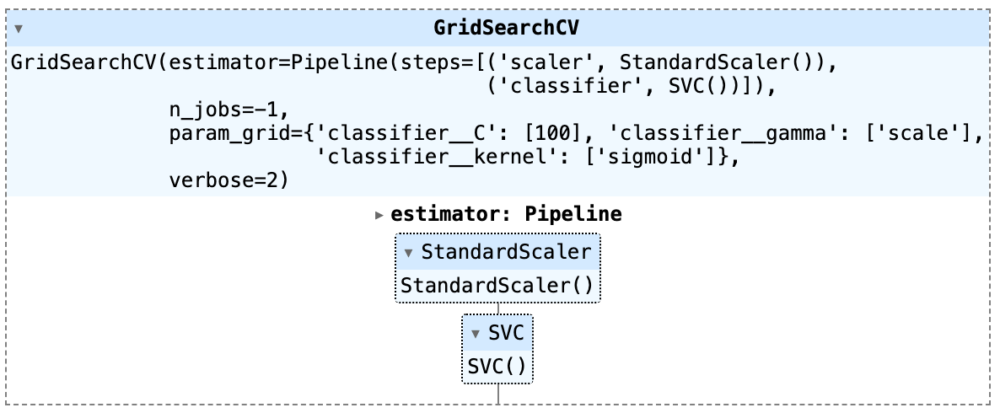  
Best parameters found: {'classifier__C': 100, 'classifier__gamma': 'scale', 'classifier__kernel': 'sigmoid'}  
Best cross-validation score: 0.2598357450136879  
```
Validation Accuracy: 0.2545952287837309
Validation Classification Report:
              precision    recall  f1-score   support

           0       0.00      0.00      0.00       706
           1       0.00      0.00      0.00        56
           2       0.00      0.00      0.00       721
           3       0.25      1.00      0.41      1302
           4       0.00      0.00      0.00       910
           5       0.00      0.00      0.00       494
           6       0.00      0.00      0.00       925

    accuracy                           0.25      5114
   macro avg       0.04      0.14      0.06      5114
weighted avg       0.06      0.25      0.10      5114
```
```
Test Accuracy: 0.2504398826979472
Test Classification Report:
              precision    recall  f1-score   support

           0       0.00      0.00      0.00       485
           1       0.00      0.00      0.00        57
           2       0.00      0.00      0.00       482
           3       0.25      1.00      0.40       854
           4       0.00      0.00      0.00       594
           5       0.00      0.00      0.00       351
           6       0.00      0.00      0.00       587

    accuracy                           0.25      3410
   macro avg       0.04      0.14      0.06      3410
weighted avg       0.06      0.25      0.10      3410
```
- **On transformed dataset**  
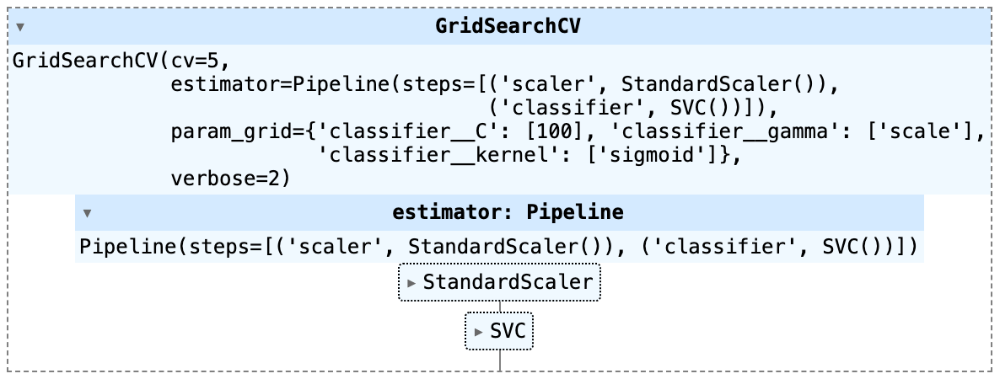  
Best parameters found: {'classifier__C': 100, 'classifier__gamma': 'scale', 'classifier__kernel': 'sigmoid'}  
Best cross-validation score: 0.2598357450136879
```
Validation Accuracy: 0.2545952287837309
Validation Classification Report:
              precision    recall  f1-score   support

           0       0.00      0.00      0.00       706
           1       0.00      0.00      0.00        56
           2       0.00      0.00      0.00       721
           3       0.25      1.00      0.41      1302
           4       0.00      0.00      0.00       910
           5       0.00      0.00      0.00       494
           6       0.00      0.00      0.00       925

    accuracy                           0.25      5114
   macro avg       0.04      0.14      0.06      5114
weighted avg       0.06      0.25      0.10      5114
```
```
Test Accuracy: 0.2504398826979472
Test Classification Report:
              precision    recall  f1-score   support

           0       0.00      0.00      0.00       485
           1       0.00      0.00      0.00        57
           2       0.00      0.00      0.00       482
           3       0.25      1.00      0.40       854
           4       0.00      0.00      0.00       594
           5       0.00      0.00      0.00       351
           6       0.00      0.00      0.00       587

    accuracy                           0.25      3410
   macro avg       0.04      0.14      0.06      3410
weighted avg       0.06      0.25      0.10      3410
```


#### Model 4: MLP
**On Original dataset**  
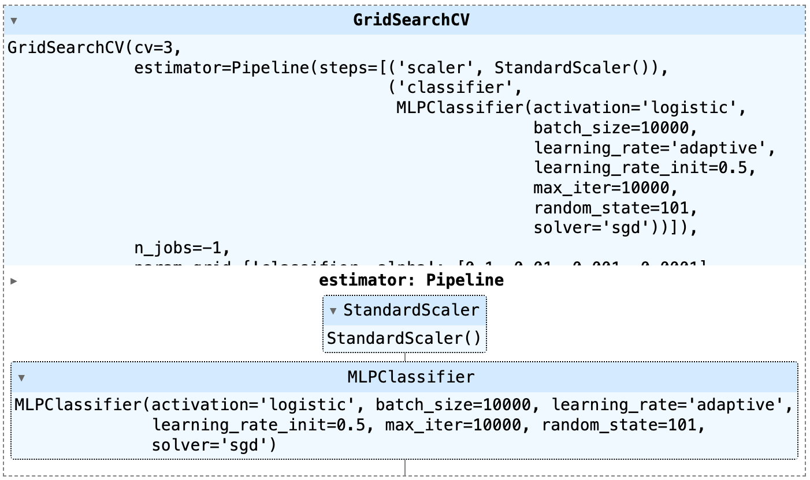  
Best parameters found: {'classifier__alpha': 0.01, 'classifier__hidden_layer_sizes': (10,)}  
Best cross-validation score: 0.35152759328583505  
```
Validation Accuracy: 0.3015252248728979
Validation Classification Report:
              precision    recall  f1-score   support

           0       0.20      0.21      0.20       706
           1       0.03      0.11      0.04        56
           2       0.19      0.16      0.17       721
           3       0.49      0.43      0.46      1302
           4       0.29      0.20      0.24       910
           5       0.29      0.49      0.37       494
           6       0.30      0.32      0.31       925

    accuracy                           0.30      5114
   macro avg       0.26      0.27      0.26      5114
weighted avg       0.31      0.30      0.30      5114
```
```
Test Accuracy: 0.3187683284457478
Test Classification Report:
              precision    recall  f1-score   support

           0       0.21      0.21      0.21       485
           1       0.06      0.18      0.09        57
           2       0.19      0.16      0.17       482
           3       0.50      0.46      0.48       854
           4       0.31      0.22      0.26       594
           5       0.32      0.46      0.38       351
           6       0.32      0.37      0.35       587

    accuracy                           0.32      3410
   macro avg       0.27      0.29      0.28      3410
weighted avg       0.33      0.32      0.32      3410
```

- **On transformed dataset**  
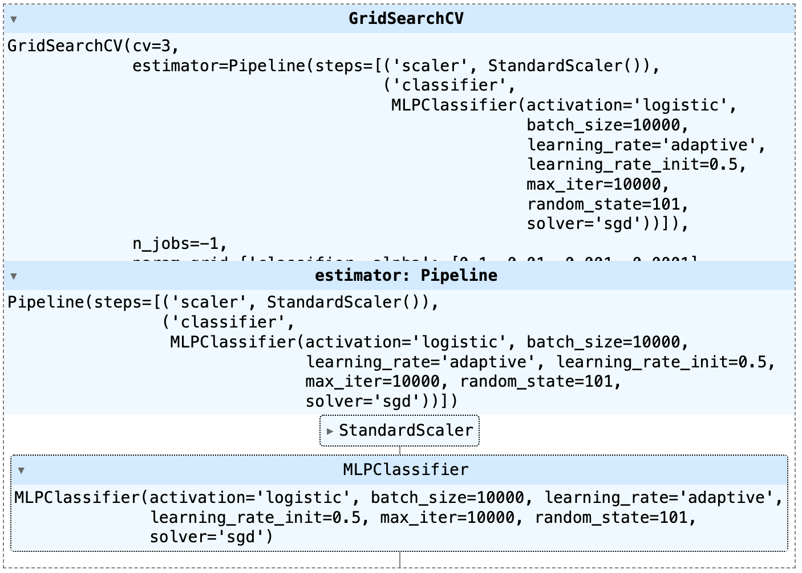
Best parameters found: {'classifier__alpha': 0.1, 'classifier__hidden_layer_sizes': (10,)}  
Best cross-validation score: 0.3402568127842853
```
Validation Accuracy: 0.29096597575283534
Validation Classification Report:
              precision    recall  f1-score   support

           0       0.22      0.26      0.24       706
           1       0.05      0.21      0.08        56
           2       0.18      0.16      0.17       721
           3       0.47      0.41      0.44      1302
           4       0.28      0.18      0.22       910
           5       0.27      0.49      0.35       494
           6       0.30      0.26      0.27       925

    accuracy                           0.29      5114
   macro avg       0.25      0.28      0.25      5114
weighted avg       0.31      0.29      0.29      5114
```
```
Test Accuracy: 0.3035190615835777
Test Classification Report:
              precision    recall  f1-score   support

           0       0.24      0.28      0.26       485
           1       0.07      0.23      0.11        57
           2       0.19      0.16      0.17       482
           3       0.51      0.42      0.46       854
           4       0.26      0.17      0.21       594
           5       0.28      0.47      0.35       351
           6       0.32      0.31      0.31       587

    accuracy                           0.30      3410
   macro avg       0.27      0.29      0.27      3410
weighted avg       0.32      0.30      0.30      3410
```

### 4. Evaluating Classification Performance 

| **Models**                        | **Training data** | **Best Parameters Found**                                                                                  | **Best Cross Validation Score** | **Validation Accuracy** | **Test Accuracy** |
| :-------------------------------- | :---------------: | :--------------------------------------------------------------------------------------------------------- | ------------------------------: | ----------------------: | ----------------: |
| Random Forest Classifier          | original          | {'classifier\_\_max\_depth': None, 'classifier\_\_n\_estimators': 200}                                     | 0\.4206                         | 0\.4192                 | 0\.4164           |
| Random Forest Classifier          | transformed       | {'classifier\_\_criterion': 'gini', 'classifier\_\_max\_depth': None, 'classifier\_\_n\_estimators': 200}  | 0\.3674                         | 0\.3597                 | 0\.3595           |
| Support Vector Classifier         | original          | {'classifier\_\_C': 100, 'classifier\_\_gamma': 'scale', 'classifier\_\_kernel': 'sigmoid'}                | 0\.2598                         | 0\.2546                 | 0\.2504           |
| Support Vector Classifier         | transformed       | {'classifier\_\_C': 100, 'classifier\_\_gamma': 'scale', 'classifier\_\_kernel': 'sigmoid'}                | 0\.2598                         | 0\.2546                 | 0\.2504           |
| K-nearest Neighbors Classifier    | original          | {'classifier\_\_metric': 'euclidean', 'classifier\_\_n\_neighbors': 4, 'classifier\_\_weights': 'uniform'} | 0\.2598                         | 0\.2546                 | 0\.2504           |
| K-nearest Neighbors Classifier    | transformed       | {'classifier\_\_metric': 'euclidean', 'classifier\_\_n\_neighbors': 4, 'classifier\_\_weights': 'uniform'} | 0\.2598                         | 0\.2545                 | 0\.2504           |
| Multi-layer Perceptron Classifier | original          | {'classifier\_\_alpha': 0\.01, 'classifier\_\_hidden\_layer\_sizes': (10,)}                                | 0\.3515                         | 0\.3015                 | 0\.3187           |
| Multi-layer Perceptron Classifier | transformed       | {'classifier\_\_alpha': 0\.1, 'classifier\_\_hidden\_layer\_sizes': (10,)}                                 | 0\.3402                         | 0\.291                  | 0\.3035           |

Based on the evaluation data, the Random Forest Classifier model performs best  

##### Show images with original labels and predictive labels on validation dataset
- Original dataset
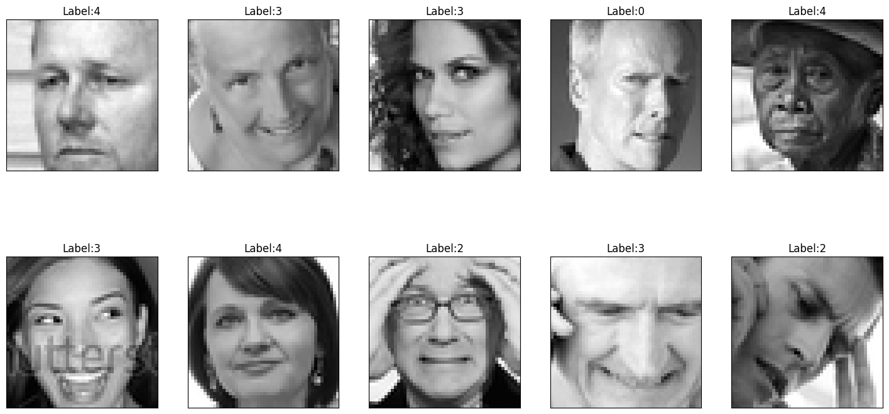  
- Predict base on original dataset
  
- Predict base on transformed dataset


#### Labels 1: Original VS Predictive
- Original dataset
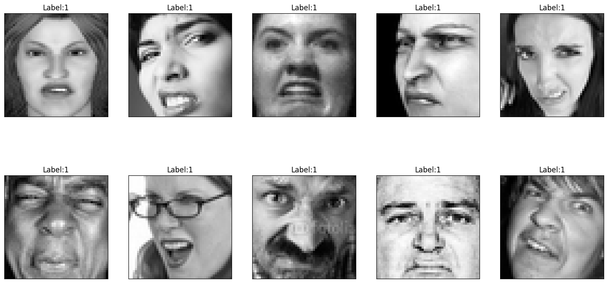  
- Predict base on original dataset
  
- Predict base on transformed dataset


#### Labels 3: Original VS Predictive
- Original dataset
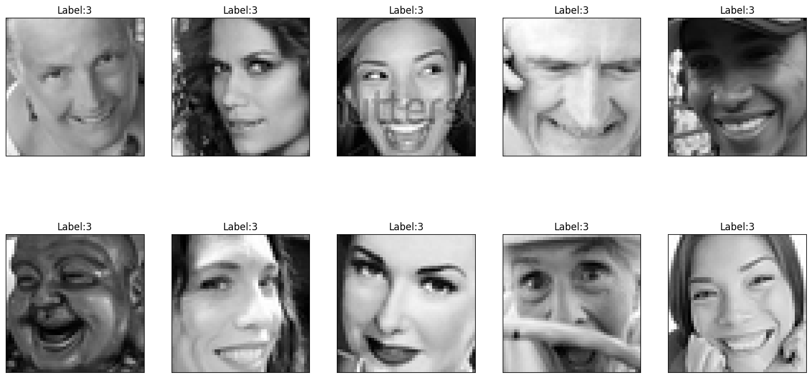  
- Predict base on original dataset
  
- Predict base on transformed dataset

